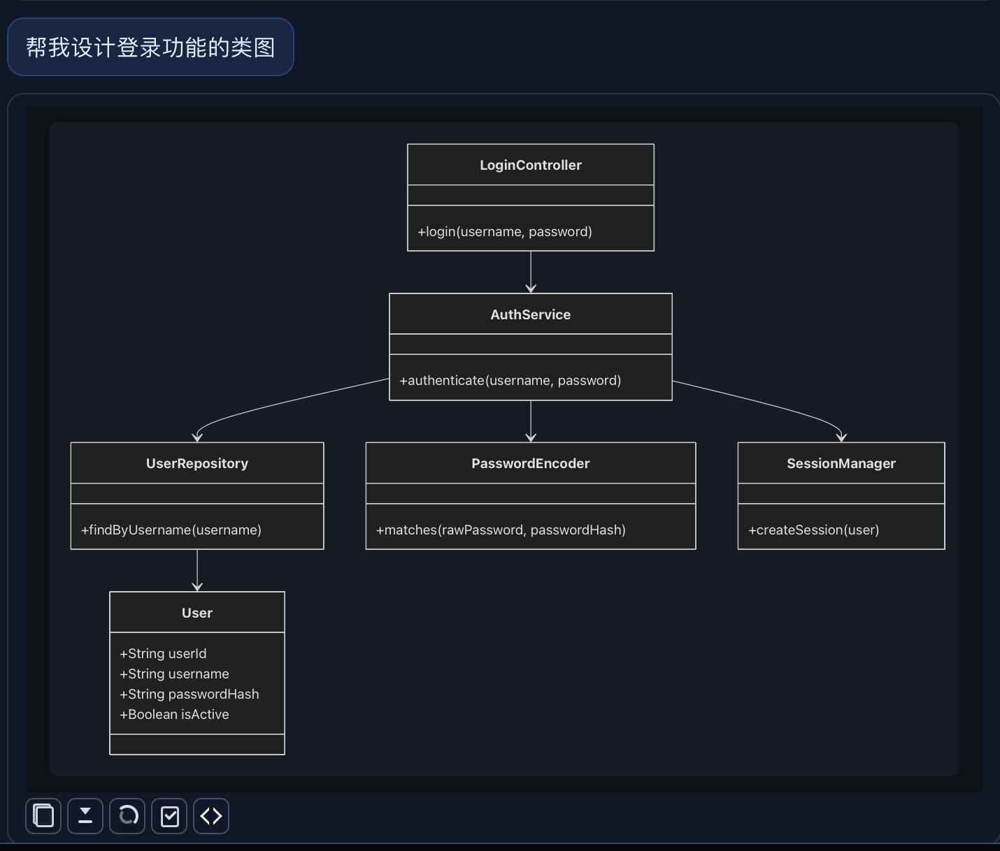
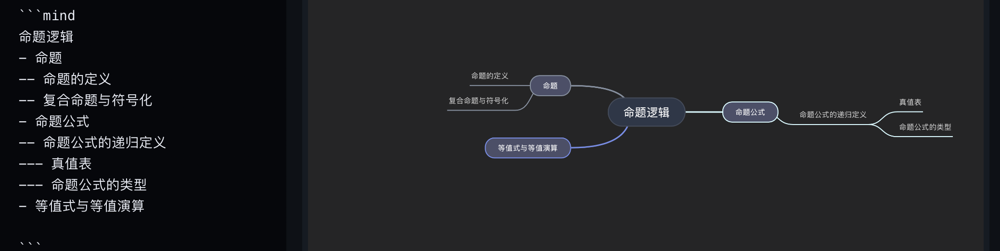

# HaoMD

高性能、跨平台的 Markdown 编辑器，基于 Tauri 2 + React + TypeScript 构建。具备实时预览、AI 助手集成、可视化图表、多标签页编辑和离线优先体验。

----

## 特性

### 核心编辑器
- 🚀 **高性能**：基于 CodeMirror 6，支持大文件（>10MB）流畅编辑
- 📑 **多标签页**：同时编辑多个文档
- 👁️ **实时预览**：分屏编辑，Markdown 实时渲染
- 💾 **自动保存**：智能自动保存，支持冲突检测
- 🔍 **大纲导航**：自动生成文档大纲，快速定位

### AI 助手
- 🤖 **多提供商支持**：Dify、OpenAI 兼容 API、
- 📄 **文档对话**：AI 助手分析文档、回答问题
- 🔄 **基于目录的会话管理**：为每个目录独立维护 AI 对话上下文
- ✂️ **选区对话**：对选中文本进行 AI 问答
- 🖼️ **视觉理解**：AI 分析图片内容
- 🧠 **全局记忆**：AI 记住跨对话的上下文
- 📝 **系统提示词**：可自定义不同场景的提示词
- 🗜️ **对话压缩**：智能压缩管理长对话

### 可视化
- 📐 **KaTeX**：用自然语言描述即可以生成精美的数学公式

- 📊 **Mermaid**：流程图、时序图、甘特图等

- 🧠 **思维导图**：交互式思维导图

### 文件管理
- 📁 **文件浏览器**：内置文件资源管理器
- 🕒 **最近文件**：快速访问最近打开的文件
- 🔗 **PDF 阅读器**：内置 PDF 查看和导航
- 🖨️ **导出功能**：导出为 PDF（通过系统打印）和 HTML

### 媒体支持
- 🎵 **音频**：直接在 Markdown 中播放 MP3、WAV、M4A、OGG、FLAC
- 🎬 **视频**：播放 MP4、WebM、MOV、OGG，支持封面图
- 📷 **图片**：支持多种图片格式，可自定义尺寸

### 用户体验
- 🎨 **深色主题**：护眼的深色模式
- 📱 **响应式设计**：适应不同窗口大小
- ⌨️ **快捷键**：完整的键盘快捷键支持

---

## 开发环境

- Node.js 18+
- npm 或 bun
- Rust stable (for Tauri)
- macOS / Windows / Linux

---

## 快速开始

### 安装依赖

```bash
cd app
npm install
# 或
bun install
```

### 开发模式

```bash
npm run tauri:dev
# 或
bun run tauri:dev
```

这将启动 Tauri 开发服务器，自动编译前端和 Rust 后端。

### 生产构建

```bash
npm run tauri build
# 或
bun run tauri build
```

构建产物位于 `app/src-tauri/target/release/bundle/` 目录。

---

## 项目结构

```
markdown/
├── app/                    # 前端应用（React + Vite）
│   ├── src/
│   │   ├── components/     # React 组件
│   │   ├── modules/        # 功能模块（AI、文件、导出等）
│   │   ├── hooks/          # 自定义 Hooks
│   │   ├── config/         # 配置文件
│   │   └── types/          # TypeScript 类型定义
│   ├── public/             # 静态资源
│   └── src-tauri/          # Rust 后端（Tauri）
├── web-chat/               # Web 版本
└── package.json
```

---

## 技术栈

| Layer | Technology |
|-------|-----------|
| **前端** | React 18, TypeScript, Vite |
| **桌面端** | Tauri 2 (Rust) |
| **编辑器** | CodeMirror 6 |
| **Markdown** | ReactMarkdown, remark/rehype plugins |
| **数学公式** | KaTeX |
| **图表** | Mermaid, Mind Elixir |
| **AI** | OpenAI SDK, 自定义 API（Dify、支持视觉的提供商） |

---

## AI 配置

HaoMD 支持多种 AI 提供商，可在应用内配置：

### 支持的提供商

- **Dify**：自定义 AI 工作流和智能体平台（默认）
- **OpenAI 兼容**：任何兼容 OpenAI 格式的 API（GPT-4、GPT-3.5、o1 等）
- **视觉支持**：任何支持视觉能力的 AI 提供商，用于图片分析

### AI 功能

- **文档对话**：与文档对话，分析内容、提问、获取摘要
- **选区对话**：选中文本，对特定部分提问
- **视觉上传**：上传图片，让 AI 分析和描述
- **全局记忆**：AI 跨对话维护上下文
- **对话历史**：访问和查看历史 AI 对话

> **注意**：使用 AI 功能需要在 设置 > AI 设置 中配置相应的 API Key。

---

## 键盘快捷键

| 命令 | macOS | Windows/Linux |
|---------|-------|---------------|
| 新建文件 | `Cmd+N` | `Ctrl+N` |
| 打开文件 | `Cmd+O` | `Ctrl+O` |
| 打开文件夹 | `Cmd+Shift+O` | `Ctrl+Shift+O` |
| 保存 | `Cmd+S` | `Ctrl+S` |
| 另存为 | `Cmd+Shift+S` | `Ctrl+Shift+S` |
| 关闭文件 | `Cmd+W` | `Ctrl+W` |
| 切换预览 | `Cmd+P` | `Ctrl+P` |
| 切换侧边栏 | `Cmd+B` | `Ctrl+B` |
| AI 聊天 | `Cmd+Shift+C` | `Ctrl+Shift+C` |
| AI 分析文件 | `Cmd+Shift+A` | `Ctrl+Shift+A` |
| AI 分析选区 | `Cmd+Shift+S` | `Ctrl+Shift+S` |
| 跳转到行 | `Cmd+L` | `Ctrl+L` |
| 查找 | `Cmd+F` | `Ctrl+F` |
| 替换 | `Cmd+H` | `Ctrl+H` |
| 格式化文档 | `Cmd+Shift+F` | `Ctrl+Shift+F` |
| 切换注释 | `Cmd+/` | `Ctrl+/` |
| 停止 AI 生成 | `Cmd+Z`（AI 生成时） | `Ctrl+Z`（AI 生成时） |

---

## 媒体支持

HaoMD 支持在 Markdown 中直接嵌入和播放媒体文件：

### 音频

```markdown

```

**支持的格式**：MP3, WAV, M4A, OGG, FLAC

### 视频

```markdown

  # 带封面图
```

**支持的格式**：MP4, WebM, MOV, OGG

### 图片

```markdown

  # 50% 宽度
  # 固定宽度
```

**支持的格式**：PNG, JPG, JPEG, GIF, SVG, WEBP

---

## Markdown 功能

### 支持的语法

- **标题**：`#` 到 `######`
- **强调**：`*斜体*`、`**粗体**`、`~~删除线~~`
- **列表**：有序列表和无序列表
- **链接**：`[文本](url)`
- **图片**：`

`
- **代码**：行内代码 `` `代码` `` 和带语法高亮的代码块
- **引用**：`> 引用`
- **表格**：标准 Markdown 表格
- **任务列表**：`- [ ]` 和 `- [x]`
- **数学公式**：KaTeX 公式 `$行内$` 和 `$$块级$$`
- **图表**：Mermaid 图表，使用 ```mermaid 代码块
- **思维导图**：Mind 导图，使用 ```mind 代码块

### GFM 扩展

- **删除线**：`~~文本~~`
- **表格**：`| 表头 | 表头 |`
- **任务列表**：`- [ ] 任务`
- **自动链接**：URL 自动转换为链接

---

## 导出

### PDF 导出

使用系统打印对话框导出为 PDF，具有优化的格式：

```typescript
// PDF 导出包括：
- 带样式的 HTML 和 CSS
- 渲染的 Mermaid 图表
- 思维导图可视化
- KaTeX 公式
- 语法高亮的代码块
```

### HTML 导出

导出为干净的、独立的 HTML 文件，内嵌样式。

---

## 贡献指南

欢迎贡献！请遵循以下步骤：

1. Fork 本仓库
2. 创建特性分支 (`git checkout -b feature/AmazingFeature`)
3. 提交更改 (`git commit -m 'Add some AmazingFeature'`)
4. 推送到分支 (`git push origin feature/AmazingFeature`)
5. 开启 Pull Request

### 开发指南

- 遵循现有的代码风格和约定
- 为新功能添加测试
- 根据需要更新文档
- 确保 TypeScript 编译通过

---

## 许可证

本项目采用 MIT 许可证 - 详见 [LICENSE](LICENSE) 文件。

---

## 路线图

- [ ] 协作编辑
- [ ] 云同步
- [ ] 插件系统
- [ ] Word 导出
- [ ] 更多图表类型（PlantUML、Graphviz）
- [ ] 自定义主题
- [ ] 移动端支持

---

## 关于

HaoMD 是一个专注于写作和文档编辑的高性能 Markdown 编辑器。它通过 Tauri 将现代 Web 技术与原生桌面性能相结合，提供流畅的响应式编辑体验。

如有问题、建议或反馈，欢迎在 GitHub 上提交 Issue。

---

## 致谢

- [Tauri](https://tauri.app/) - 桌面应用框架
- [React](https://reactjs.org/) - UI 库
- [CodeMirror](https://codemirror.net/) - 文本编辑器组件
- [KaTeX](https://katex.org/) - 数学公式渲染
- [Mermaid](https://mermaid-js.github.io/) - 图表渲染
- [Mind Elixir](https://github.com/awehook/remark-mindmap) - 思维导图渲染

