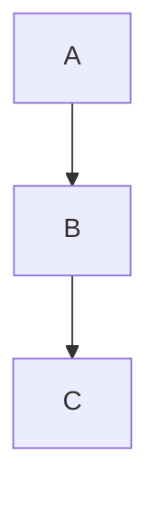

## HaoMD 中 KaTeX & mermaid 导出方案（草案）

> 目标：在导出 HTML / PDF / Word 时，保留 KaTeX 公式与 mermaid 图表的最终效果，并支持可选地将对应的图片与源码信息写回到 Markdown 文件中。

---

### 一、总体设计思路

- 统一导出主线：
  1. 从编辑器获取当前 Markdown：`getCurrentMarkdown()`。
  2. 用 remark/rehype 等解析为 AST。
  3. 基于 AST 构造一棵「导出结构树」（Export AST）：
     - **普通节点**：段落、标题、列表、表格、文本、普通图片等。
     - **Math 节点**：KaTeX 数学公式（行内 / 块级）。
     - **Diagram 节点**：mermaid / mind 图。
  4. 在导出阶段，统一对 Math/Diagram 节点做「**math & mermaid → SVG/PNG 图片**」处理。
  5. 按目标分支：
     - 导出 HTML：生成包含 ``/`<svg>` 的完整 HTML 文档。
     - 导出 PDF：基于 HTML 打印 / HTML→PDF 工具生成 PDF。
     - 导出 Word：基于包含图片的 HTML 或 docx 库生成 `.docx` 文件。

- 可选扩展：在用户主动触发时，将已生成的公式 / 图表图片引用**写回当前 Markdown 文件**，并保留对应的源码（LaTeX / mermaid）作为注释块，方便后续再生成或编辑。

---

### 二、导出结构树（Export AST）设计

> 该结构只存在于导出流程内部，不改变原始 Markdown 文本。

#### 2.1 节点类型示意（伪代码）

```ts
// 普通导出节点
export type ExportNode =
  | { type: 'paragraph'; children: ExportNode[] }
  | { type: 'heading'; level: 1 | 2 | 3 | 4 | 5 | 6; children: ExportNode[] }
  | { type: 'text'; content: string }
  | { type: 'list'; ordered: boolean; items: ExportNode[][] }
  | { type: 'code'; language?: string; content: string }
  | { type: 'image'; alt?: string; src: string } // 原始 markdown 中的图片
  | MathNode
  | DiagramNode

// 数学公式
export type MathNode = {
  type: 'math'
  latex: string
  display: boolean // true = 块级公式，false = 行内公式
  image?: {
    format: 'svg' | 'png'
    data: Uint8Array | string // 渲染后的 SVG/PNG 数据（Buffer 或 base64 文本）
  }
}

// 图表（mermaid / mind）
export type DiagramNode = {
  type: 'diagram'
  kind: 'mermaid' | 'mind'
  code: string
  image?: {
    format: 'svg' | 'png'
    data: Uint8Array | string
  }
}
```

#### 2.2 从 Markdown AST 到 Export AST

- 使用 remark/rehype 将 Markdown 解析为 AST。
- 遍历 AST：
  - 文本、段落、标题、列表、表格 → 按结构映射到对应 ExportNode。
  - `inlineMath` / `math`（remark-math 提供） → 构造 `MathNode`：
    - `latex`: 原始 LaTeX 文本。
    - `display`: 是否是块级公式。
  - `code` 且 `language === 'mermaid'` → 构造 `DiagramNode(kind: 'mermaid')`。
  - mind 专用代码块同理，可构造成 `DiagramNode(kind: 'mind')`。

此时，`MathNode.image`、`DiagramNode.image` 还为空，后续在渲染阶段填充。

---

### 三、KaTeX 公式 → SVG/PNG 图片

#### 3.1 渲染目标

- 在导出阶段，将每个 `MathNode.latex` 渲染为一份矢量或位图图片：
  - 优先 **SVG**：体积小、无损缩放，可用于 HTML / PDF / 新版 Word。
  - 可选生成 **PNG**：用于兼容旧 Word 或外部系统需求。

#### 3.2 渲染流程（前端 JS 环境）

1. 定义工具函数（伪代码）：

   ```ts
   async function renderMathToSvg(latex: string, display: boolean): Promise<string> {
     // 调用 KaTeX / MathJax 的“SVG 输出”API
     // 返回 `<svg>...</svg>` 字符串
   }
   ```

2. 遍历 Export AST：
   - 找到所有 `MathNode`；
   - 对每个 `node.latex` 调用 `renderMathToSvg`；
   - 结果写入：

   ```ts
   node.image = {
     format: 'svg',
     data: svgString,
   }
   ```

3. 如需 PNG：
   - 可提供可选步骤：
     - 将 SVG 绘制到 `<canvas>`；
     - `canvas.toDataURL('image/png')` 得到 PNG data URL；
     - 保存为 `format: 'png'`。

---

### 四、mermaid 图表 → SVG/PNG 图片

#### 4.1 渲染目标

- 将 Markdown 中的 ` ```mermaid` 代码块统一转换为图形图片：
  - 优先为 SVG；
  - 可必要时转为 PNG。

#### 4.2 渲染流程

1. 定义 `renderMermaidToSvg(code: string): Promise<string>`：
   - 初始化 mermaid：`mermaid.initialize({ ... })`；
   - 使用 `mermaidAPI.render(id, code)` 返回 SVG 字符串；
   - 不必真正插入 DOM，只使用返回的字符串。

2. 遍历 Export AST：
   - 对 `DiagramNode` 且 `kind === 'mermaid'`：

   ```ts
   node.image = {
     format: 'svg',
     data: svgString,
   }
   ```

3. 对 mind 图：
   - 若已有 Rust 后端命令 `render_xmind` 返回 SVG：

   ```ts
   const resp = await invoke('render_xmind', { input: code, ... })
   node.image = {
     format: 'svg',
     data: resp.data,
   }
   ```

---

### 五、写回 Markdown 文件的约定（可选功能）

> 目的：在 Markdown 文件本身中，既保留 **可编辑源码**（LaTeX / mermaid），又增加 **图片引用**，方便 Word / 其他工具直接使用图片。

#### 5.1 资产目录结构

- 对于一个 Markdown 文件，例如：
  - `notes/math-demo.md`
- 约定其图片资产目录：
  - `notes/math-demo.assets/`
  - 内部文件：
    - `eq-1.svg`, `eq-2.svg`, ...（公式图片）
    - `mermaid-1.svg`, `mermaid-2.svg`, ...（mermaid 图）

命名规则可按在文中出现的顺序编号，或用哈希值保证稳定性。

#### 5.2 Markdown 写回格式：公式（KaTeX）

原始写法：

```md
这是一个公式：

$$
E = mc^2
$$
```

写回后的格式（示例）：

```md
这是一个公式（源码）：

<!-- math-source:start id=eq-1 -->
$$
E = mc^2
$$
<!-- math-source:end id=eq-1 -->


```

说明：

- `math-source:start` / `math-source:end` 注释块：
  - 内部保留原始 LaTeX 源码；
  - 后续如需重新生成图片，可从此处读取源码。
- ``：
  - Word、HTML 导出时会显示为公式图片；
  - PDF 导出同样基于图片渲染。

渲染策略建议：

- `MarkdownViewer` 可识别 `math-source` 注释 + 下方图片为一组：
  - 默认仅显示图片；
  - 提供“显示源码”模式，以便在 UI 中查看/编辑 LaTeX。

#### 5.3 Markdown 写回格式：mermaid 图表

原始写法：

```md

```

写回后的格式（示例）：

```md
图表（源码）：

<!-- diagram-source:start id=mermaid-1 kind=mermaid -->

<!-- diagram-source:end id=mermaid-1 -->


```

说明：

- `diagram-source` 注释块：
  - 保存 mermaid 源码及元信息（如 `kind=mermaid`）。
- 下方图片引用：
  - 指向对应的 SVG/PNG 文件。

渲染策略建议：

- 预览时识别 `diagram-source` 注释 + 图片作为一组：
  - 默认只显示图片；
  - 提供查看/编辑源码的 UI（例如侧边栏或弹窗）。

#### 5.4 写回流程（命令级逻辑）

可以设计一个命令：**“写入公式/图表快照到 Markdown”**，对当前文件执行：

1. 扫描当前 Markdown：
   - 找所有 `$$...$$` 或 remark-math 的 `math` 节点；
   - 找所有 ```mermaid``` 代码块；
   - 找已有的 `math-source` / `diagram-source` 注释对与图片引用，避免重复生成。

2. 为每个尚未有 id 的节点分配 id：
   - 公式：`eq-1`, `eq-2`, ...
   - mermaid：`mermaid-1`, `mermaid-2`, ...

3. 根据 Export AST 中的 `image` 字段，写出图片文件：
   - `math-demo.assets/eq-1.svg` 等。

4. 修改 Markdown 文本：
   - 用注释块包裹原始公式 / mermaid 段落；
   - 在其后插入对应的 `` 行。

5. 通过现有持久化层保存 `.md` 文件和资产文件。

> 注意：写回是一个**可选操作**，可以只对用户明确触发的命令生效，避免在每次保存时自动改动 Markdown 内容。

---

### 六、不同导出目标上的使用方式

#### 6.1 导出 HTML

- 基于 Export AST 和图片数据生成 HTML：
  - 普通节点 → 对应的 `<p>`, `<h1>`, `<ul>` 等；
  - `MathNode` / `DiagramNode`：
    - 若 `image.format === 'svg'`：
      - 可直接插入 `<svg>` 片段，或使用 ``。
    - 若 `image.format === 'png'`：
      - 使用 ``。
- `generateHTMLTemplate` 将 body 包装为完整 HTML 文档，嵌入必要样式。

#### 6.2 导出 PDF

- 使用 HTML 导出的结果作为输入：
  - 在桌面端通过“打印为 PDF”或后端 HTML→PDF 工具转换；
  - math/mermaid 已经是 SVG/PNG 图片，无需额外处理。

#### 6.3 导出 Word（.docx）

- 路线 A：HTML → docx 工具：
  - 直接将包含 `` 的 HTML 喂给 HTML→docx 库（如 `html-docx-js`）；
  - 得到 `.docx` 文件，图片作为内嵌资源。

- 路线 B：使用 `docx` 库构建：
  - 遍历 Export AST：
    - 文本/段落/列表 → `Paragraph` / `Heading` 等；
    - 图片节点（包括 Math/Diagram 节点） → `ImageRun`（通过 `Media.addImage`）。

在这两条路线中，math/mermaid 都已经统一为图片节点，不需要额外特殊处理。

---

### 七、小结

- **导出统一主线**：
  - Markdown → Export AST（包含 MathNode / DiagramNode） → 图片化 math & mermaid → 根据目标生成 HTML / PDF / Word。

- **写回 Markdown 方案**：
  - 对用户主动触发的命令，将已生成的 SVG/PNG 图片写入 `*.assets` 目录；
  - 在 `.md` 中用注释块保留源码，用 `` 引用图片；
  - 兼顾“可编辑源码”与“可在 Word/其他工具直接使用图片”的需求。

本方案可以先从「仅导出」做起（不写回 Markdown），待导出链路稳定后，再实现「写回 Markdown」命令，以减少对现有编辑体验的影响。